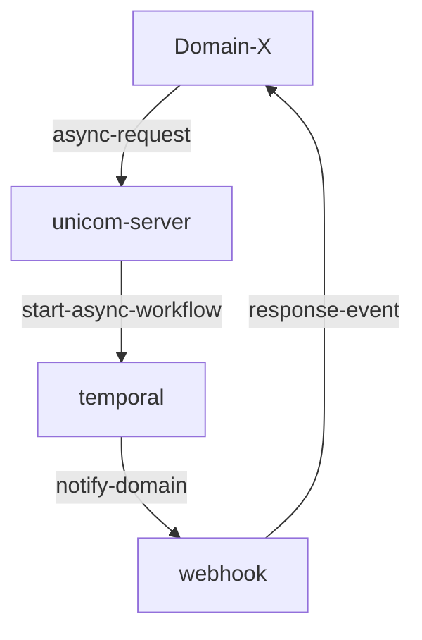
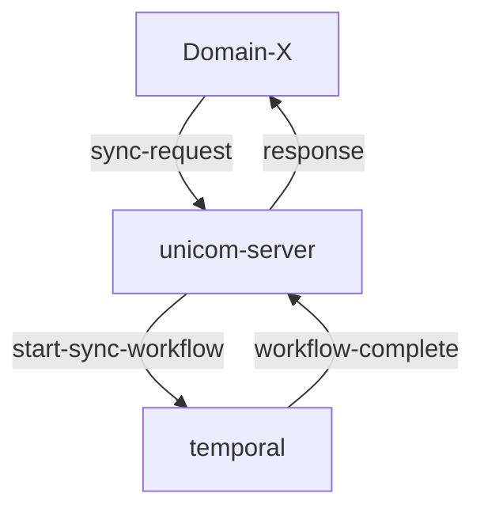

## Unicom 

How it all works.

### Asynchronous Request example

1. Domain-X makes an async request to send a notification to unicom (email for now)
1. Unicom-server initiats a workflow and responds back with the workflow ID
1. Temporal executes the workflow, initiating the request at the requested time.
1. After successful completion or failure to send the communication the result is returned to the domain via the requested medium(SQS/EventBridge/Webhook).

### Synchronous Request example

1. Domain-X makes a sync request to send a notification to unicom (email for now)
1. Unicom-server initiats a workflow
1. Temporal executes the workflow and the unicom-server waits for the workflow to complete.
1. After successful completion or failure to send the communication the result is returned to the domain via the same grpc/http request they initiated the request with.